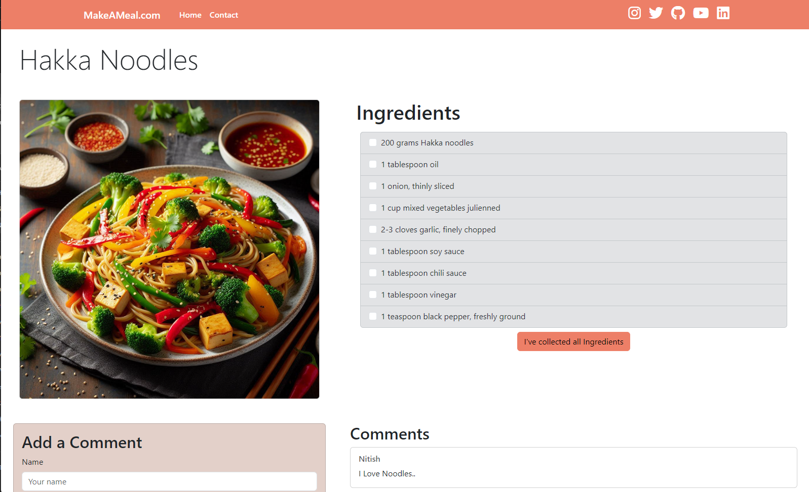

# Live Link

https://d2iwvyc0wrco7o.cloudfront.net/

---

### 🟢 Description
This is a full stack project using `React` + `Django` + `Postgres` + `AWS`

### 🟢 Installation
To install `React` frontend:

```
cd frontend
npm i
npm run dev
```

To install `Django` backend
```
cd backend
python3 -m venv venv
source venv/bin/activate
pip install -r requirements.txt
python manage.py migrate
python manage.py runserver
```

## Screenshots


